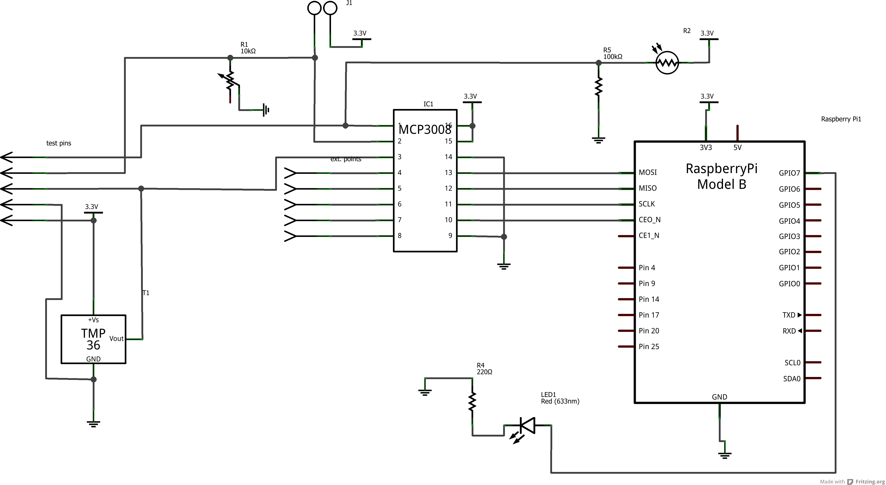
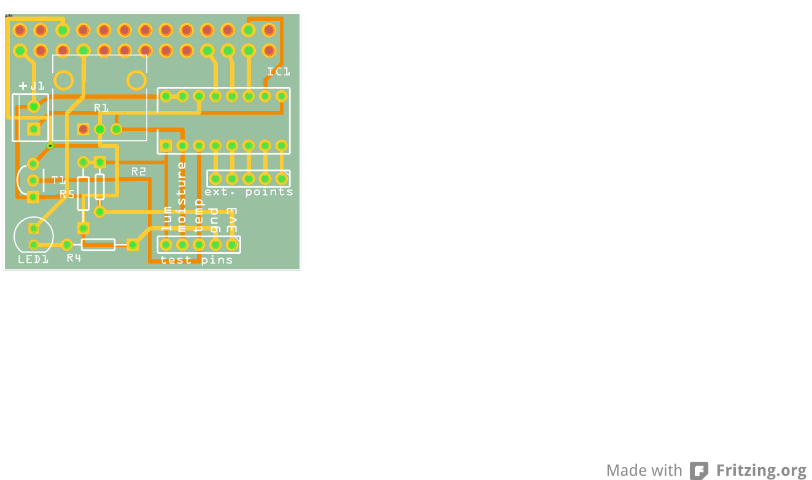

# GreenPi

This is a complete solution to monitor a desktop plant.

We get the following readings:

* temperature
* light level
* soil moisture

## Usage

This is a simple Raspberry Pi shield, which stacks on the raspberry's GPIOs.

Here is the schematic:



and here is the board:



## Installation

Simply clone the repository on the target raspberry:

```sh

apt-get install -y git rpi.gpio
cd ~
git clone https://github.com/paulollivier/greenpi
```

*for now*: create an account on [xively](https://xively.com/), create a new device.

Copy the given feed ID and API key to you `.bashrc` like so:

```
$ vim ~/.bashrc

export XIVELY_API_KEY=YOUR_API_KEY
export XIVELY_FEED_ID=YOUR_FEED_ID
```

And your [Pushover](https://pushover.net/) user key, if you want to use it. Really great with [Pebble](https://getpebble.com/).


then simply run `sudo -E ~/greenpi/watcher.sh start`.

You should see the values on your xively device page.

Mine is available [here](https://xively.com/feeds/812814885).

## TODO

* get rid of xively, use some sqlite db instead, for instance. Provide a mini flask app to graph data.
* use a config file, instead of environment variables?

